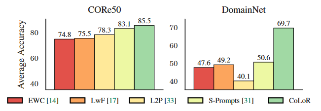

# continual learning with LoRA

## abstract

1. primary--inspire from prompt tuning.
2. now--CoLoR(base on LoRA+S-prompt)
3. better average accuracy and parameter-efficient(**参数效率**) 

## introduction

1. catastrophic forgetting

   1. Robert M French. Catastrophic forgetting in connectionist networks. Trends in cognitive sciences, 3(4):128–135, 1999
   2. Michael McCloskey and Neal J Cohen. Catastrophic interference in connectionist networks: The sequential learning problem. In Psychology of learning and motivation, volume 24, pages 109–165. Elsevier, 1989

2. catastrophic forgetting for pretrained transformer

   1. Vinay Venkatesh Ramasesh, Aitor Lewkowycz, and Ethan Dyer. Effect of scale on catastrophic forgetting in neural networks. In International Conference on Learning Representations, 2022.

3. Low Rank Adaption

   1. Edward J Hu, Yelong Shen, Phillip Wallis, Zeyuan Allen-Zhu, Yuanzhi Li, Shean Wang, Lu Wang, and Weizhu Chen. LoRA: Low-rank adaptation of large language models. In International Conference on Learning Representations, 2022.

4. unsupervised method to infer

   1. Yabin Wang, Zhiwu Huang, and Xiaopeng Hong. S-prompts learning with pre-trained transformers: An occam’s razor for domain incremental learning. In NeurIPS, 2022

5. DIL:label is fixed,dataset change(关注于如何适应不同的数据分布或领域变化)

   CIL:label change-->so it causes difficulies on new class(关注于如何逐步增加新的类别)

   TIL:task change(关注于不同任务的学习)

6. CoLoR vs Prompt

   CoLoR faster

7. Appendix A:how to choose prompt

   Appendix B:vision transformer

8. use math to describe why LoRA can use fewer efficiences.

9. CoLoR

   1. Training:pretrain model h and each specific dataset D

      **留个链接转跳在这，要转跳到LoRA那篇的数学原理看明白**

   2. inference:

      1. each dataset D's k data into vector
      2. use pretrain model h to infer 
      3. **有点没看懂**

## experiment

1. setup:similar as Yabin Wang, Zhiwu Huang, and Xiaopeng Hong. S-prompts learning with pre-trained transformers: An occam’s razor for domain incremental learning. In NeurIPS, 2022

2. dataset

   domain dataset:

   CORe50:11dataset 50 class/8 class for train,3 for test

   DomainNet:6dataset 345class

   class dataset:

   Split CIFAR-100:splits the CIFAR-100 into 10 datasets of 10 contiguous classes each.

3. domain IL

   CoLoR is better than replay-based

4. class IL

   proposed CoLoR++:update base on the first dataset

   **他的说法是：**L2P use VIT to representation extractor，so CoLoR++ train to get representation extractor，**这就公平了？？**

   

